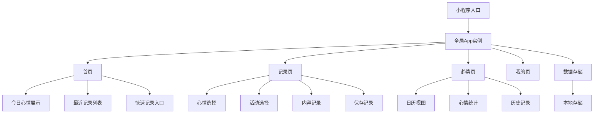
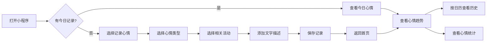
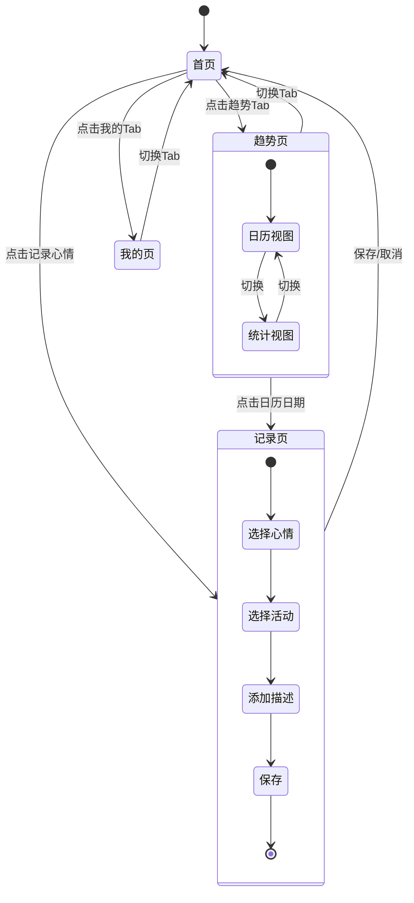
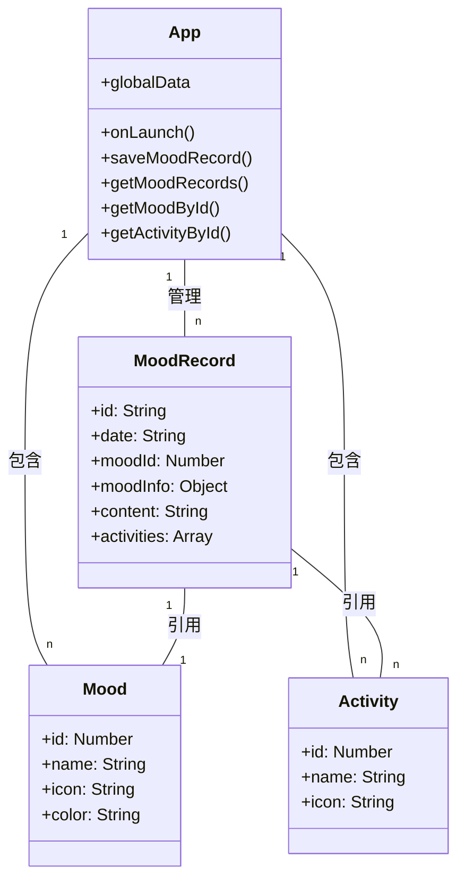
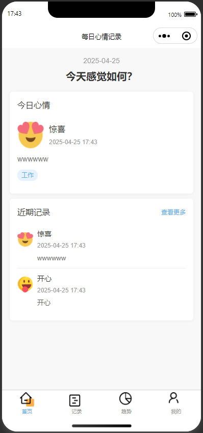
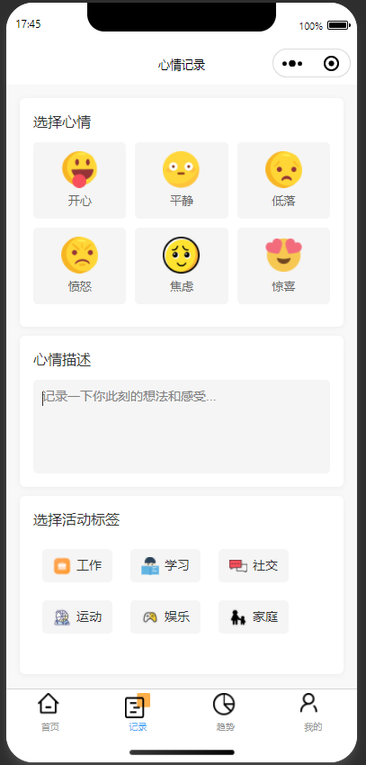
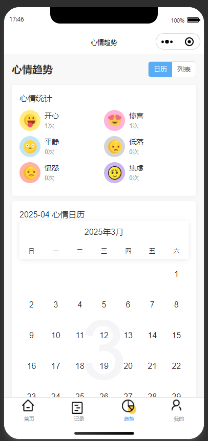
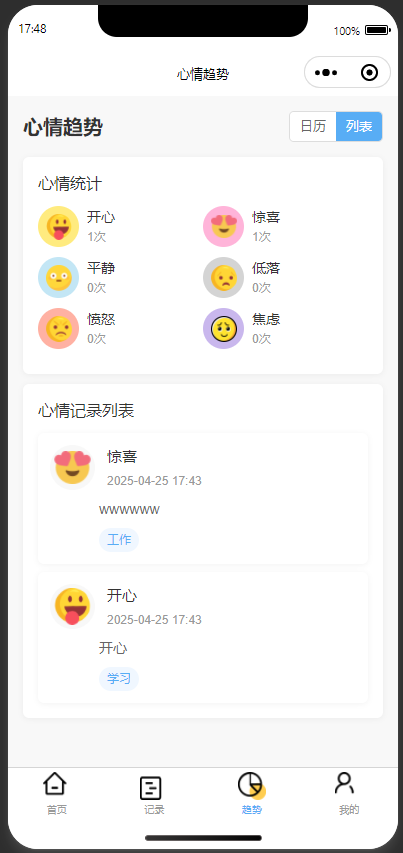
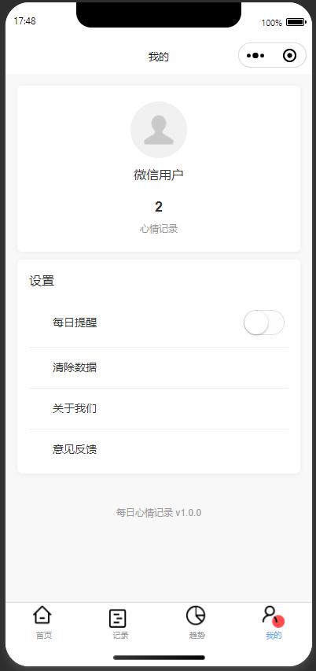

# 每日心情记录小程序

## 项目介绍
每日心情记录是一款微信小程序，帮助用户记录和追踪每天的情绪变化。通过简单直观的界面，用户可以选择当天的心情，记录相关活动和内容，并查看历史记录和情绪趋势分析。

## 功能特点

### 心情记录
- 支持6种不同心情状态：开心、平静、低落、愤怒、焦虑、惊喜
- 每种心情都有对应的图标和颜色标识
- 可以记录与心情相关的活动类型：工作、学习、社交、运动、娱乐、家庭
- 支持添加文字描述，记录更多细节

### 数据可视化
- 日历视图：直观展示每日心情记录
- 统计分析：展示不同心情的占比和趋势
- 历史记录浏览：查看过去的心情记录详情

### 用户体验
- 简洁清晰的界面设计
- 快速记录今日心情
- 查看最近的心情记录

## 项目架构图



## 用户操作流程



## 数据流转图



## 数据模型



## 技术栈
- 微信小程序原生开发框架
- Vant Weapp UI组件库 (@vant/weapp)
- ECharts图表库 (echarts-for-weixin)
- 微信日历组件 (@lspriv/wx-calendar)

## 项目结构
```
├── pages                     // 页面文件
│   ├── index                 // 首页
│   ├── record                // 记录页面
│   ├── trend                 // 趋势分析页面
│   └── my                    // 个人中心页面
├── images                    // 图片资源
│   ├── mood                  // 心情图标
│   ├── activity              // 活动图标
│   └── icon                  // 应用图标
├── utils                     // 工具函数
├── app.js                    // 全局逻辑
├── app.json                  // 全局配置
└── app.wxss                  // 全局样式
```

## 安装和使用

### 开发环境
1. 安装微信开发者工具
2. 克隆项目到本地
3. 使用微信开发者工具打开项目
4. 配置AppID（如需体验完整功能）

### 项目依赖
项目依赖以下第三方库：
```json
{
  "dependencies": {
    "@lspriv/wx-calendar": "^1.8.4",
    "@vant/weapp": "^1.11.7",
    "echarts-for-weixin": "^1.0.2"
  }
}
```

### 使用说明
1. 首页：查看今日心情和最近记录，点击心情图标快速记录
2. 记录页：选择心情、活动，添加文字描述
3. 趋势页：查看心情日历和统计分析
4. 我的页：个人设置和应用信息

## 数据存储
应用使用微信小程序的本地存储功能（wx.setStorageSync/wx.getStorageSync）保存用户的心情记录数据，所有数据均保存在用户设备本地，不涉及云端存储。

## 后续开发计划
- [ ] 支持导出数据功能
- [ ] 添加更多统计分析图表
- [ ] 增加提醒功能
- [ ] 支持自定义心情和活动类型

## 项目截图

### 首页



### 记录




### 趋势

- 日历显示



- 列表显示



### 我的



## 联系方式

如有任何问题或建议，欢迎提交Issue或联系开发者。
